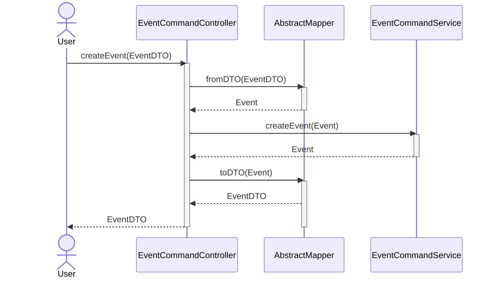

# uek223_MultiUserApp_backend
### Noel, Masha, Mischa

## Description
This is the backend for the MultiUserApp. It is a RESTful API that is used to store and retrieve data from a database.
In this Repository, we will implement the Event Entity for the Project.

## Installation

1. `git clone https://github.com/mimasala/uek223_MultiUserApp_backend.git`
2. Create an API key for OpenAI TODO(hugn) Add link here
3. Create file called `apikey` inside /src/main/resources and copy-paste the key there.
4. open the project in your IDE
5. run the project


## Our own Features

- [x] Event Entity
  - [x] CRUD Operations
- [ ] Recommendation System for users

## Usage
We have implemented Swagger, where you can browse the API and test it.
Additionally, we have a seperate [documentation](https://docs.google.com/document/d/1pb5MifRRxSE2RfPzKkzWbbY9kzEW65t68-RpkPGK6Tc/edit?usp=sharing)


----

### the create event endpoint




----

## Starter Project Spring Boot

### Docker command
```
docker run --name postgres_db -e POSTGRES_USER=postgres -e POSTGRES_PASSWORD=postgres -p 5432:5432 -d postgres
```

### Troubleshooting

```
org.postgresql.util.PSQLException: ERROR: relation "role_authority" does not exist
```
Simply restart the application. Hibernate sometimes does not initialize the tables fast enough an causes thios error. restarting the application fixes this.
